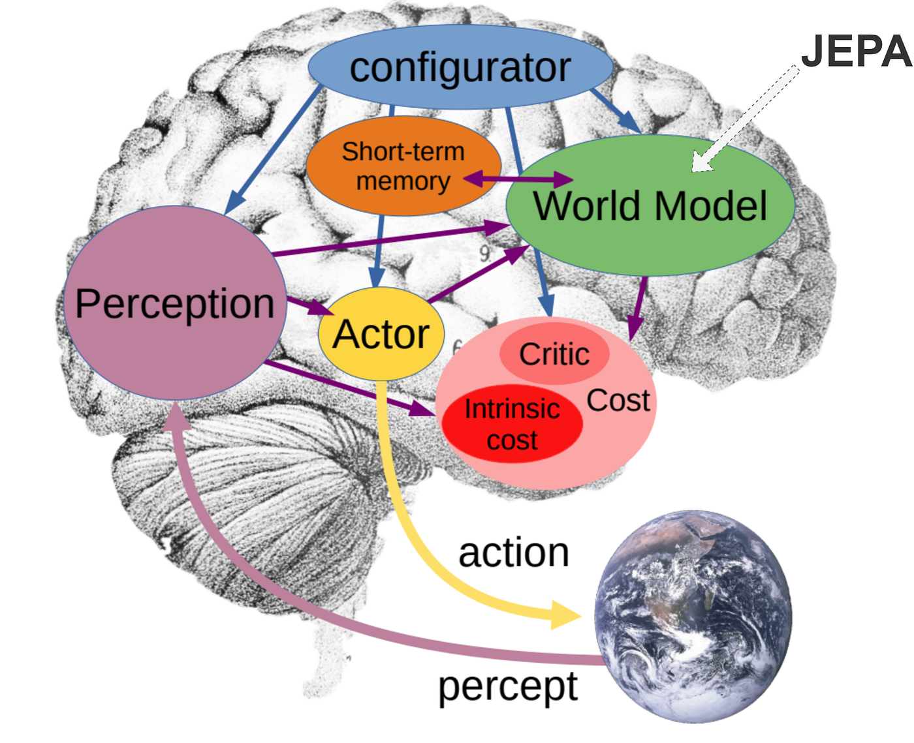

</img>

## x-jepa

Explorations into some of the approaches advocated by Yann LeCun, and just a more wholistic architecture (JEPA) in general

## Citations

```bibtex
@inproceedings{LeCun2022APT,
    title   = {A Path Towards Autonomous Machine Intelligence},
    author  = {Yann LeCun and Courant},
    year    = {2022},
    url     = {https://api.semanticscholar.org/CorpusID:251881108}
}
```

```bibtex
@misc{maes2026leworldmodelstableendtoendjointembedding,
    title   = {LeWorldModel: Stable End-to-End Joint-Embedding Predictive Architecture from Pixels},
    author  = {Lucas Maes and Quentin Le Lidec and Damien Scieur and Yann LeCun and Randall Balestriero},
    year    = {2026},
    eprint  = {2603.19312},
    archivePrefix = {arXiv},
    primaryClass = {cs.LG},
    url     = {https://arxiv.org/abs/2603.19312},
}
```

```bibtex
@misc{teoh2026nextlatentpredictiontransformerslearn,
    title   = {Next-Latent Prediction Transformers Learn Compact World Models}, 
    author  = {Jayden Teoh and Manan Tomar and Kwangjun Ahn and Edward S. Hu and Tim Pearce and Pratyusha Sharma and Akshay Krishnamurthy and Riashat Islam and Alex Lamb and John Langford},
    year    = {2026},
    eprint  = {2511.05963},
    archivePrefix = {arXiv},
    primaryClass = {cs.LG},
    url     = {https://arxiv.org/abs/2511.05963}, 
}
```
